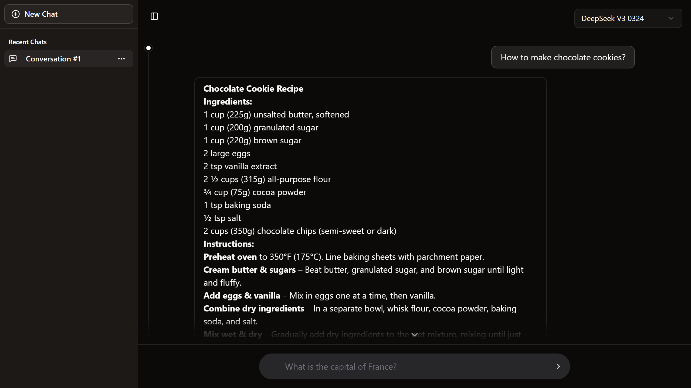

# RouterChat



**Live Demo:** [https://router-chat-sigma.vercel.app/](https://router-chat-sigma.vercel.app/)

RouterChat is a web-based AI chatbot interface. It utilizes Next.js for the frontend and backend and connects to OpenRouter to allow users to interact with various free AI language models. The application features a clean, responsive dark-mode design with smooth animations.

## Features

- AI model selection and real-time streaming responses
- Conversation management with automatic saving to local storage
- Sidebar with conversation list, editing, and deletion
- Persistent model selection and responsive design
- Toast notifications and loading indicators

## Technologies Used

- Next.js (App Router)
- TypeScript
- Tailwind CSS
- shadcn/ui & Aceternity UI
- Lucide React (Icons)
- Motion (Animations)
- Browser Local Storage
- OpenRouter API

## Project Structure

The project follows a standard Next.js App Router structure:

```
.
├── app/                      # Next.js App Router: Routes, layouts, API routes
│   ├── api/                  # API routes
│   │   └── chat/
│   │       └── route.ts      # Handles chat completions
│   ├── layout.tsx            # Root layout
│   ├── page.tsx              # Main page component
│   └── globals.css           # Global styles (includes Tailwind config)
├── components/               # Reusable UI components
│   ├── ui/                   # shadcn/ui & Aceternity UI components
│   └── chat/                 # Chat-specific components
├── lib/                      # Utility functions, types, constants
└── ... (config files, etc.)
```

## Getting Started

First, run the development server:

```bash
npm run dev
# or
yarn dev
# or
pnpm dev
# or
bun dev
```

Open [http://localhost:3000](http://localhost:3000) with your browser to see the result.

## API Key Management

This project requires an OpenRouter API key to interact with AI models. You need to set this key as an environment variable.

1.  Obtain an API key from OpenRouter.
2.  Create a `.env.local` file in the root of your project (if it doesn't exist).
3.  Add the following line to your `.env.local` file:
    ```
    OPENROUTER_API_KEY=your_openrouter_api_key_here
    ```
    Replace `your_openrouter_api_key_here` with your actual API key.
4.  When deploying to Vercel, add `OPENROUTER_API_KEY` as an environment variable in your Vercel project settings.

**Note:** The `.env.local` file is ignored by Git (`.gitignore`) and should not be committed to your repository.
